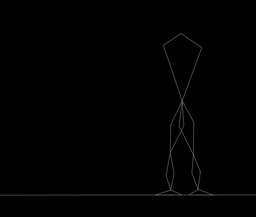

## pygtgym

___




A python wrapper for reinforcement learning gym environments created using the [genesis-tubs](https://github.com/mauicv/genesis-tubs-engine) JavaScript physics engine.

**Note**: _This repo is under development_

___


## setup

To do so by hand use:

```sh
python3 -m venv venv
pip install -upgrade pip
pip install -r requirements.txt
cd src/js
npm install
```

Or

```sh
make setup
```

___


## tests

With virtual environment active.

```sh
python tests/setup.py
python tests/gui.py
```

or

```sh
make test
```
